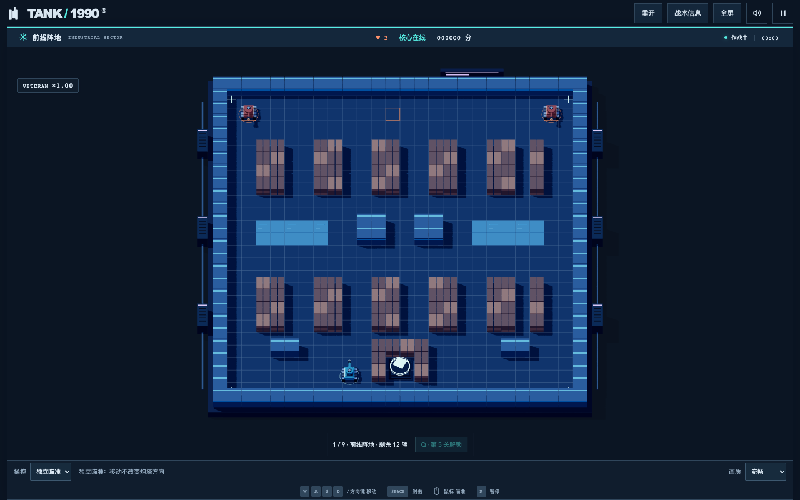
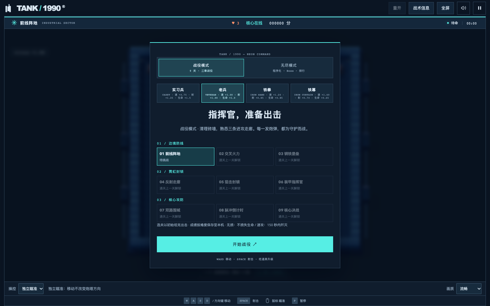
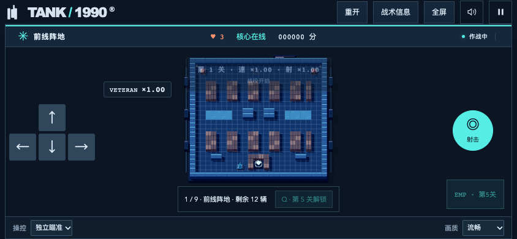
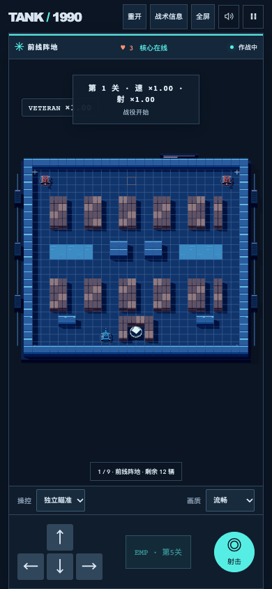
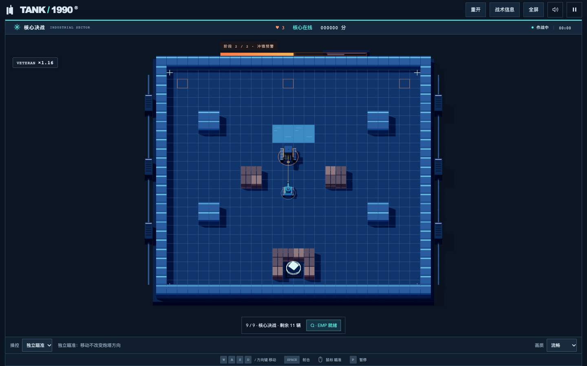

# 九关战役与战术玩法验收

本轮扩展整屏战场、战术敌人和三章九关战役。以下为自动验收与截图检查，不替代仓库要求的人工试玩。

- 规则测试：234 项通过。包含九张地图的出生点和通路、完整视野、狙击锁定/EMP 取消、正面装甲减伤、Boss 两阶段攻击与撞墙停止、斜向双发不自相抵消、跨难度成绩保存。
- 生产构建通过。现有单文件体积提示仍存在；构建未失败。
- 基础浏览器回归通过：真实按键移动/射击、基地受击、重开焦点、内存稳定、手机触摸、音效、生产构建无调试入口。
- 战役回归通过：逐关布置末敌并用真实射击过关，覆盖全部九关；第八关必须满 90 秒；检查升级、解锁、胜利、刷新后的成绩与选关。它验证状态推进，不代表人工完整通关。
- 改装回归通过：战役与无尽三选一、移动端选择、跨波次与重置。
- 霓虹回归通过：独立/经典瞄准、遮挡、键盘/触屏 EMP、暂停/换波冷却、Bloom 缓冲释放、减少动态效果。切换画质后的纹理数均为 4。
- 战术 UI 集成通过：最终关正常生成 18 HP Boss，半血进入第二阶段，显示冲锋预警，Q 触发 EMP 后取消预警并施加干扰。
- 布局回归通过：1440×900、390×844、844×390，完整战场、触控不遮战场、无横向溢出、全屏切换、信息抽屉自动暂停及关闭后保持暂停。

截图使用流畅画质，横屏底部目标提示单独预留空间，避免覆盖基地。

人工试玩建议：从第一关连续推进体验改装节奏；在第五关横移躲开粉色狙击线并尝试 Q；第六/九关绕侧攻击装甲、观察 Boss 半血冲锋；第八关完成 90 秒守点。选择较低难度也可解锁后续关卡。进度只保存在当前浏览器中。
