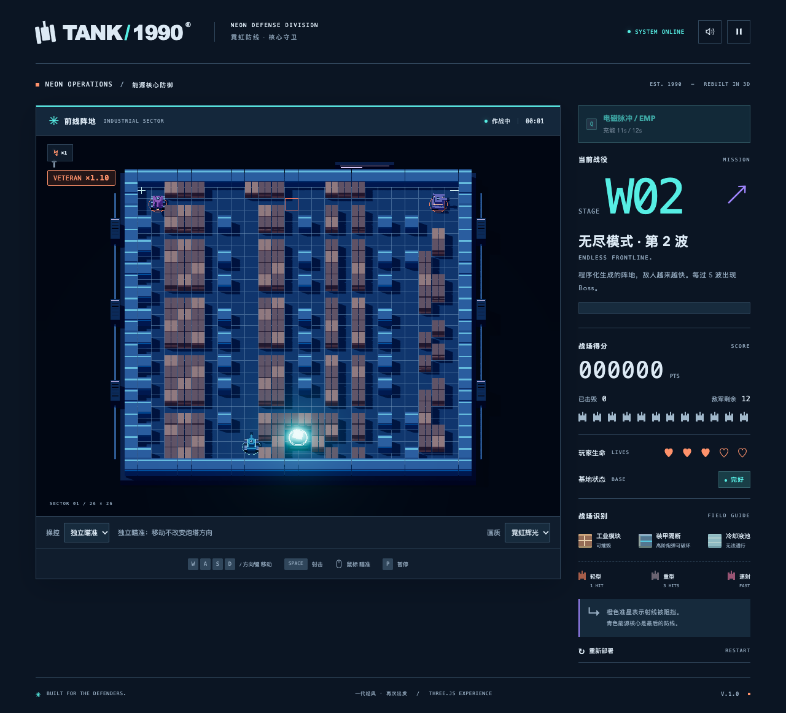
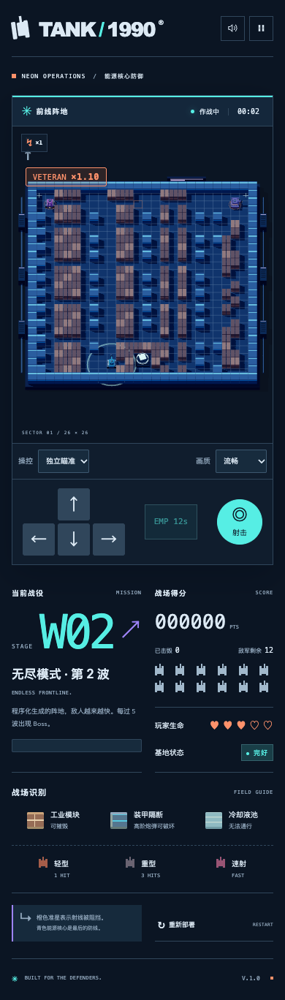

# 霓虹防线交付验证

验证日期：2026-09-27。浏览器：macOS Chrome / Playwright，WebGL 软件渲染。

## 已实现

- 独立 / 经典瞄准切换与本机偏好保存；6 格贴地碰撞提示；视觉转向和启停俯仰。
- 深色作战终端、工业模块、装甲隔断、坦克识别灯、能源核心和外围设施。
- 霓虹辉光 / 流畅模式；切换时回收后处理资源；支持减少动态效果。
- 无尽模式新增一次跳弹改装与 Q / 触屏 EMP。EMP 半径 4 格，普通敌军干扰 2 秒、Boss 0.45 秒，冷却 12 秒。
- 无尽地图实例扩容、水域渲染与固定出生通道修正。

## 验证结果

- `npm test`：226 / 226 通过。
- `npm run build`：通过。主包约 672 kB，gzip 约 177 kB；Vite 提示超过当前 650 kB 分包建议阈值。
- `test:browser`：桌面移动 / 射击、暂停、基地失败、重试、移动端触摸、音效与生产构建通过；无页面错误或失败请求。
- `test:levels`：三关推进、难度、改装、积分延续、最终胜利与新战役通过。
- `test:upgrades`：战役与无尽改装选择、构筑延续与手机布局通过。
- `test:neon`：瞄准模式、首碰撞提示、键盘与手机 EMP、暂停与换波冷却、四张地图出生通道、辉光切换、减少动态效果通过。
- 四次静态重开后的 GPU 几何数量：56 / 56 / 56 / 56。
- 三次辉光开启后回到流畅模式的纹理数量：4 / 4 / 4。
- 手机视口 390 px，页面宽度 390 px，无水平溢出。

生产预览使用 4174，以避开本机另一个项目占用的 4173。本报告验证功能与资源回收，不代表真实移动设备的帧率基准。

